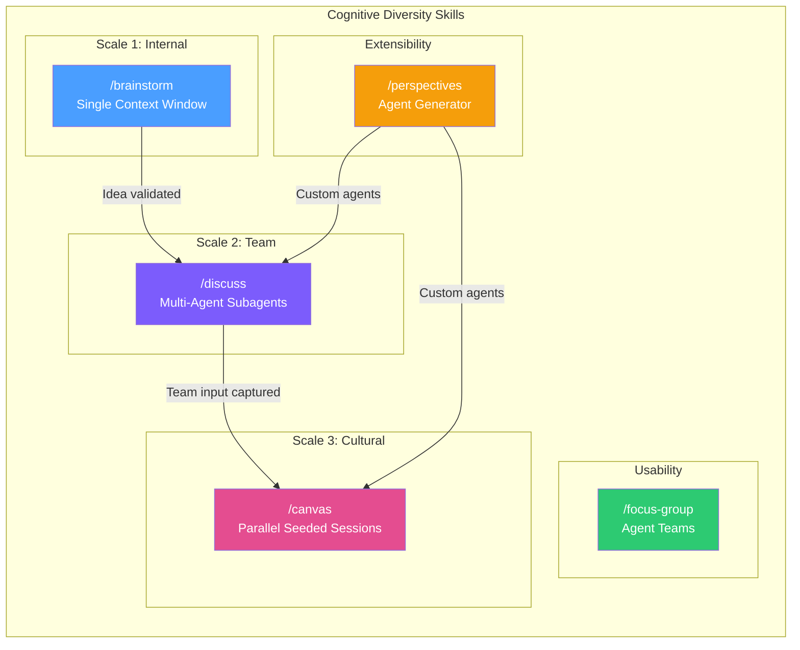
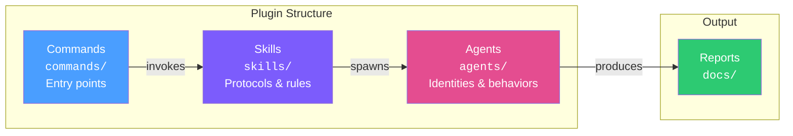
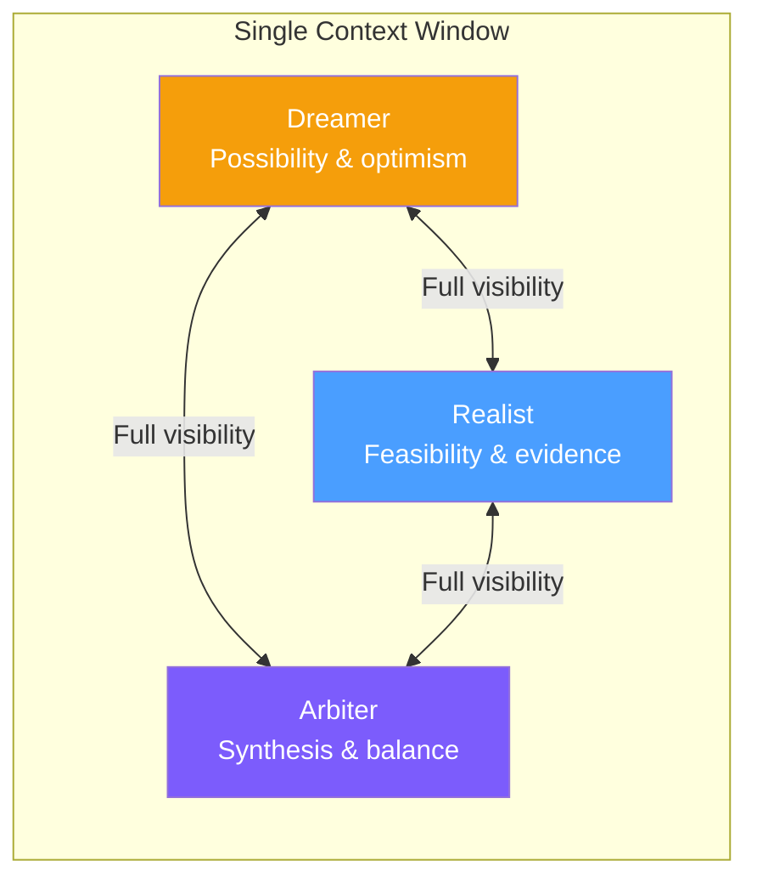
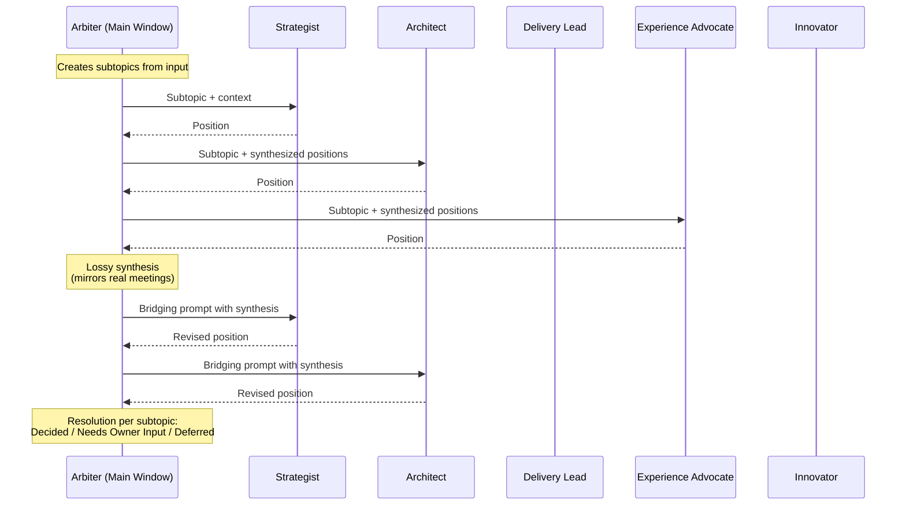
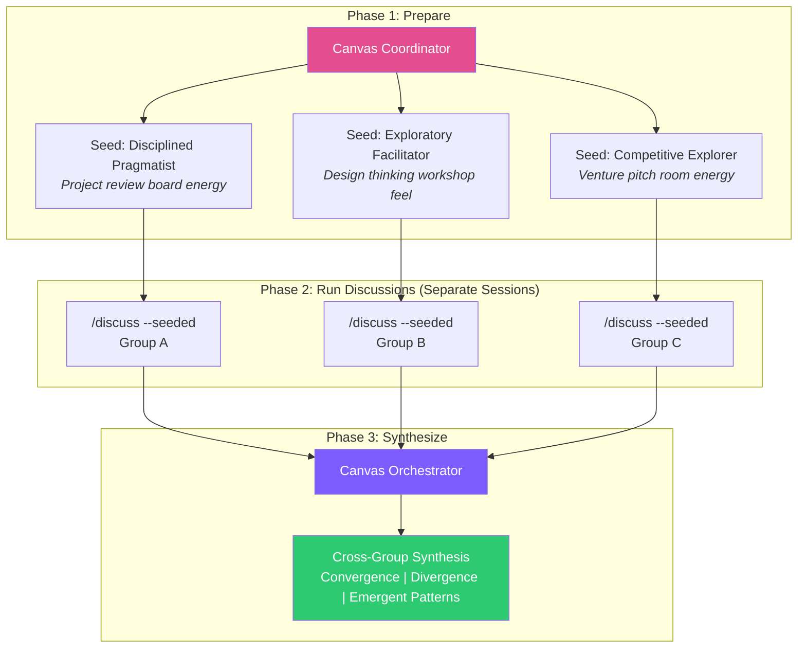
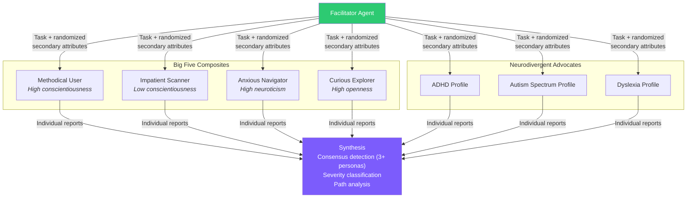

# Cognitive Diversity Skills

Multi-perspective deliberation protocols for [Claude Code](https://claude.ai/code). Five commands that use your existing Claude subscription to examine ideas, plans, and experiences through diverse cognitive lenses.

Cognitive Diversity creates productive deliberation in a synthetic environment about whatever topic you provide. Walk an idea through several modes intended to mimic the deliberation process from within one person's mind (`/brainstorm`), a presentation to several people (`/discuss`), to the reaction across different cultural compositions (`/canvas`). You can get initial thoughts on how people with different psychological profiles may respond to a single task (`/focus-group`). All commands produce a final report summarizing the activity to aid your own decision-making process.

**IMPORTANT:** This is not intended as caricature or a replacement for real people; it is simply a tool to help you surface considerations you may otherwise miss.

## Commands

| Command | Purpose |
|---------|---------|
| `/brainstorm` | Three-lens ideation: Dreamer, Realist, Arbiter |
| `/discuss` | Multi-perspective structured discussion with 5 perspective agents |
| `/canvas` | Culturally-seeded discussion sessions with cross-group synthesis |
| `/focus-group` | Cognitive profile usability screening with 7 persona agents |
| `/perspectives` | Generate, list, and validate custom domain-specific perspectives |

## System Architecture

The system is organized as a suite of Claude Code skills, each implementing a distinct deliberation protocol at a different scale of human interaction.



### Three Scales of Deliberation

The five commands map to three nested scales of how humans deliberate, plus a usability testing layer and an extensibility mechanism:

| Scale | Command | Analogy | Agent Architecture |
|-------|---------|---------|-------------------|
| Internal | `/brainstorm` | The debate inside one person's head | Single context window, shared state |
| Team | `/discuss` | A facilitated meeting with competing priorities | Isolated subagents, lossy synthesis |
| Cultural | `/canvas` | The same meeting held across different cultures | Parallel sessions, meta-synthesis |
| Usability | `/focus-group` | A UX research panel with diverse cognitive profiles | Agent Teams, parallel task dispatch |
| Extensibility | `/perspectives` | Hiring domain experts for the meeting | Agent file generator and validator |

## Component Architecture



- **Commands** (`commands/`) provide the `/command` entry points that Claude Code recognizes.
- **Skills** (`skills/`) define the protocols -- session structure, output formats, behavioral rules, and facilitation logic.
- **Agents** (`agents/`) define perspective identities -- what each agent cares about, how they reason, and how they communicate.

The plugin uses only your Claude subscription. No external APIs, no MCP servers, no additional costs.

---

## How It Works

### `/brainstorm` -- One mind, three lenses

This is the deliberation process inside one person's head. Within a single context window, the LLM plays three roles: Dreamer, Realist, and Arbiter.



The Dreamer represents the optimism of the idea and its possibilities. The Realist is the devil's advocate, reminding the Dreamer those possibilities are nothing if they can't be sustained. The Arbiter represents one's higher consciousness, tasked with finding the right balance.

All three roles share the same context window -- every utterance is visible to all subsequent utterances. This creates a tightly integrated exchange where the voices genuinely inform each other. The protocol detects two modes automatically:

- **Problem Exploration** -- broad need, generate multiple solution directions
- **Solution Deep-Dive** -- specific approach, flesh into concrete shape with strengths and gaps

```
/brainstorm We need a way to onboard new developers faster
```

Output: `docs/brainstorms/[topic-slug]-[YYYY-MM-DD].md` -- an idea brief with strengths, open questions, needed research, and emergent threads.

---

### `/discuss` -- Several people with competing priorities

This approximates the reactions of people related by a common mission but with competing priorities. The architecture shifts to a multi-agent design with isolated context windows.



Each perspective is a subagent with its own context window and no direct access to the other agents' transcripts. The Arbiter summarizes the responses from one agent and feeds them to the others for their reactions. This is, by nature, a lossy process -- but it is not unlike real conversation. In a real meeting room, if participants were asked to repeat what the last speaker said, none of them would repeat it word for word.

**Default perspectives** (technology company):

| Perspective | Evaluates through the lens of... |
|-------------|----------------------------------|
| Strategist | Business sustainability, client impact, revenue |
| Architect | Long-term technical health, reliability, patterns |
| Delivery Lead | Executable delivery, realistic scope, team capacity |
| Experience Advocate | User/client experience, accessibility, quality |
| Innovator | Unexplored opportunities, unexamined assumptions |

**Two modes:**

- **`propose`** -- pre-commitment: "Should we do this? How should we shape it?"
- **`plan`** -- post-commitment: "How do we execute this well?"

```
/discuss propose Should we adopt a monorepo for our frontend packages?
/discuss plan @docs/migration-plan.md
```

Output: `docs/decisions/[mode]-[topic-slug]-[YYYY-MM-DD].md` -- decisions with rationale, alternatives considered, and items needing owner input.

---

### `/canvas` -- The same idea across different cultures

How might the idea be received by groups guided by different cultural principles? Canvas runs multiple `/discuss` instances in parallel, each seeded with a distinct cultural archetype and psychological profile set, then synthesizes findings across groups.



**Two layers of behavioral seeding:**

| Layer | Framework | Affects | Example |
|-------|-----------|---------|---------|
| Cultural | Hofstede Dimensions | Arbiter facilitation style | High power distance = seniority anchors discussion |
| Psychological | Big Five (OCEAN) | Agent argumentation style | High agreeableness = seeks merit in others' positions first |

The cultural dimensions modify *how the meeting is run* (call order, consensus vs. competition, tolerance for ambiguity). The Big Five profiles modify *how each agent argues* (not what they care about, but how assertively, cautiously, or collaboratively they make their case).

**9 included cultural archetypes** (derived from Hofstede dimensions):

| Archetype | Behavioral Feel |
|-----------|----------------|
| Disciplined Pragmatist | Demanding project review board |
| Exploratory Facilitator | Design thinking workshop |
| Institutional Steward | Large organization making a durable decision |
| Focused Collaborator | Well-run sprint planning |
| Competitive Explorer | Venture pitch room |
| Visionary Director | Founder's strategy offsite |
| Engineering Review | Safety-critical engineering review |
| Directive Lead | Team lead's standup before a critical deployment |
| Peer Review | Academic tenure committee |

```
/canvas --output-mode interpret API versioning strategy
# ... run the generated /discuss commands in separate sessions ...
/canvas synthesize docs/canvas/api-versioning-2026-03-29/
```

Output: `docs/canvas/[topic-slug]-[YYYY-MM-DD]/canvas-synthesis.md`

---

### `/focus-group` -- Cognitive profile screening

Uses Claude Code's Agent Teams feature. The facilitator spawns 7 agents in parallel, each representing a distinct cognitive profile, assigns them a task with randomized secondary attributes, and synthesizes findings into a structured usability report.



**Randomized secondary attributes** (assigned per persona per run):

| Attribute | Possible Values |
|-----------|----------------|
| Tech comfort | Low, Moderate, High |
| Domain familiarity | First visit, Some exposure, Experienced |
| Urgency | Browsing casually, Moderate task pressure, Urgent deadline |
| Device context | Desktop, Laptop, Tablet, Mobile |
| Mood/patience | Patient, Neutral, Frustrated before starting |

**Consensus framework:** An issue mentioned by 3+ personas is flagged as consensus. Severity is classified as Task-Blocking, High Friction, Moderate, or Minor based on the highest level reported by any persona.

**Three modes:**

- **Browser** -- navigates a live URL using Playwright
- **Document** -- evaluates a markdown, PDF, or text file
- **Scenario** -- reasons through a described situation

```
/focus-group --mode browser https://example.com "Complete the checkout process"
/focus-group --mode document onboarding-email.md "Follow these instructions to set up your account"
```

Output: `docs/focus-groups/[target-slug]-[YYYY-MM-DD].md` -- consensus findings, profile-specific issues, severity ratings, and evidence-based recommendations.

---

### `/perspectives` -- Custom domain perspectives

The built-in perspectives suit a technology company. For other domains, generate a custom roster:

```
/perspectives generate healthcare
```

This creates 3-5 domain-specific perspectives (e.g., clinician, regulator, patient-advocate) that `/discuss` and `/canvas` will pick up automatically. Use `--roster` to select specific perspectives for a session:

```
/discuss propose --roster clinician,regulator,patient-advocate "EHR integration strategy"
```

**Perspective loading precedence** (highest first):

1. `.claude/perspectives/` in the current working directory (project-local)
2. `~/.claude/perspectives/` (user-global)
3. `agents/perspectives/` in this plugin (built-in defaults)

---

## Repository Structure

```
cognitive-diversity/
├── brainstorm/                  # Scale 1: Internal deliberation
│   ├── SKILL.md                 #   Protocol: mode detection, phases, output format
│   ├── dreamer.md               #   Persona: optimism, possibility, lateral thinking
│   ├── realist.md               #   Persona: feasibility, evidence, sustainability
│   └── arbiter.md               #   Persona: synthesis, balance, facilitation
│
├── discuss/                     # Scale 2: Team deliberation
│   ├── SKILL.md                 #   Protocol: subtopics, call order, synthesis rules
│   ├── propose.md               #   Mode: pre-commitment behavioral overrides
│   ├── plan.md                  #   Mode: post-commitment behavioral overrides
│   └── perspectives/            #   5 default perspective agents
│       ├── strategist.md
│       ├── architect.md
│       ├── delivery-lead.md
│       ├── experience-advocate.md
│       └── innovator.md
│
├── canvas/                      # Scale 3: Cultural deliberation
│   ├── SKILL.md                 #   Coordinator: prepare/synthesize phases
│   ├── archetypes.json          #   9 Hofstede-derived cultural profiles
│   ├── behavioral-translation.md #  How dimensions map to behavior
│   ├── canvas-orchestrator.md   #   Subagent: cross-group synthesis
│   └── seed-schema.json         #   JSON schema for seed profile validation
│
├── focus-group/                 # Usability: Cognitive profile testing
│   ├── commands/run.md          #   Command definition and mode inference
│   ├── agents/
│   │   └── focus-group-facilitator.md  # Team lead agent
│   └── skills/focus-group/
│       ├── SKILL.md             #   Synthesis patterns, severity framework
│       ├── REFERENCE.md         #   Behavioral translation guide
│       └── personas/            #   7 cognitive profile agents
│           ├── fg-methodical-user.md
│           ├── fg-impatient-scanner.md
│           ├── fg-anxious-navigator.md
│           ├── fg-curious-explorer.md
│           ├── fg-adhd-profile.md
│           ├── fg-autism-profile.md
│           └── fg-dyslexia-profile.md
│
└── perspectives/                # Extensibility: Custom agent generation
    └── SKILL.md                 #   Generate, list, validate subcommands
```

## Architectural Benefits

### Isolation Preserves Independent Thinking

In `/discuss` and `/canvas`, each perspective agent operates in its own context window with no direct access to other agents' transcripts. This prevents the consensus pressure that occurs when all participants share the same information space. The Arbiter's lossy synthesis between agents mirrors how real facilitated meetings work -- participants hear summaries, not verbatim transcripts -- and this intentional information loss produces more diverse positions.

### Behavioral Seeding Separates Identity from Style

The two-layer seeding system in `/canvas` cleanly separates *what an agent cares about* (their perspective definition) from *how they argue* (Big Five profile) and *how the meeting is run* (cultural dimensions). This means the same five perspectives can produce meaningfully different outcomes depending on the cultural and psychological context they operate in, without requiring different agent definitions.

### Consensus Through Convergence, Not Averaging

The `/focus-group` consensus framework flags issues that 3+ personas independently identify -- convergence across different cognitive profiles. This is fundamentally different from averaging scores or tallying votes. When a methodical user, an ADHD profile, and an anxious navigator all encounter the same friction point through different cognitive paths, the signal is strong.

### Progressive Fidelity Across Scales

Each scale adds complexity only where it adds value. `/brainstorm` uses a single context window because internal deliberation benefits from tight integration. `/discuss` isolates agents because competing priorities need independent reasoning. `/canvas` parallelizes entire sessions because cultural facilitation styles need to operate without interference. The architecture matches the communication pattern to the deliberation scale.

### Domain Portability Through Perspective Generation

The `/perspectives` command makes the entire deliberation system domain-portable. The built-in technology company perspectives are not hardcoded assumptions -- they are the default implementation of a contract that any domain can fulfill. A healthcare team generates clinician, regulator, and patient-advocate perspectives; a legal team generates litigator, compliance-officer, and client-counselor perspectives. The deliberation protocols remain unchanged.

### No External Dependencies

The entire system runs on your existing Claude subscription. No external APIs, no MCP servers (except Playwright for browser-mode focus groups), no vector databases, no additional costs. Every component is a markdown file that Claude Code interprets directly.

## Requirements

- Claude Code CLI, desktop app, or IDE extension
- For `/focus-group`: `CLAUDE_CODE_EXPERIMENTAL_AGENT_TEAMS` enabled in settings
- For `/focus-group` browser mode: Playwright MCP server configured

## License

MIT
